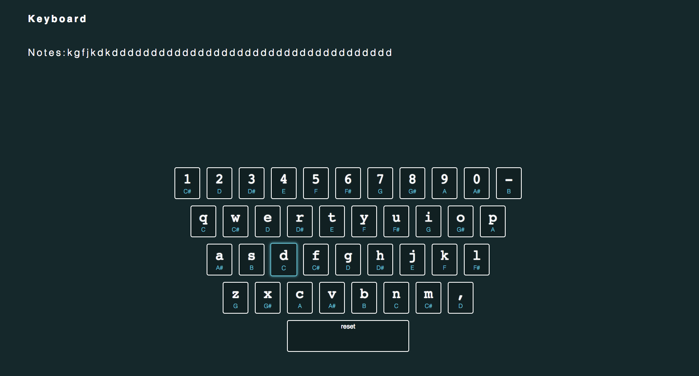

## Keyboard

Keyboard is a simple app written in JavaScript, inspired by JavaScript30 challenge. I have mapped the sound of piano keys to the Mac keyboard. Notes typed are displayed on screen and can be reset using the spacebar.

### Installation
- clone this repo
- cd into the folder
- open **index.html**
- compose and play on your 'keyboard'
