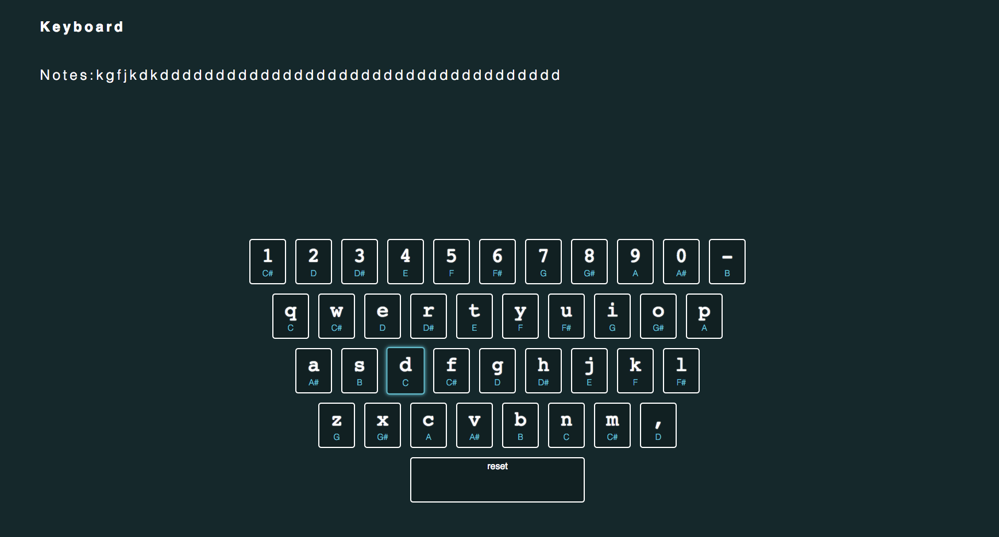

## Keyboard

Keyboard is a virtual piano app written in JavaScript, inspired by JavaScript30 challenge. Notes are displayed on screen and can be reset using spacebar.

[Play](https://lcbeh.github.io/Keyboard/)
